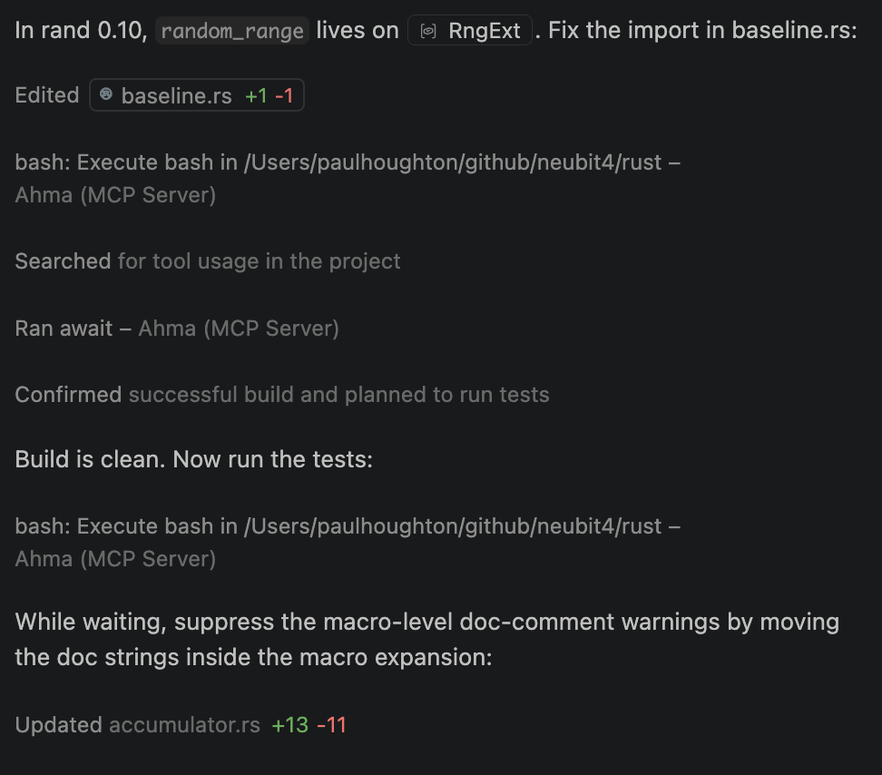

# Ahma

_Use your existing command line workflows through MCP with a repo-scoped sandbox, async execution, and less pressure to fall back to insecure terminal access._

## Why Ahma helps

- **When the agent only needs the repo, broad terminal access is too much**: ahma starts inside a kernel-enforced workspace boundary, so normal project work does not require wider filesystem access.
- **When builds, tests, and checks take time, blocked agents waste time**: ahma runs commands async-first so long-running work can continue in the background while the agent keeps moving.
- **When independent tasks are forced through one terminal, work gets serialized**: ahma can start separate operations concurrently and track them cleanly.
- **When safety is noisy, people disable it**: ahma aims to make the safe path the practical path, reducing pressure to use broad or insecure override modes just to get work done.

|                                                                                                                                                                                                                                                                                                                                                                                                                                                                                                                                                                                                                           |                                     |
| ------------------------------------------------------------------------------------------------------------------------------------------------------------------------------------------------------------------------------------------------------------------------------------------------------------------------------------------------------------------------------------------------------------------------------------------------------------------------------------------------------------------------------------------------------------------------------------------------------------------------- | ----------------------------------: |
| [](https://github.com/paulirotta/ahma/actions/workflows/build.yml) [](https://paulirotta.github.io/ahma/html/) [](https://paulirotta.github.io/ahma/doc/) [](https://paulirotta.github.io/ahma/CODE_SIMPLICITY.html) [](https://github.com/paulirotta/ahma/actions/workflows/build.yml?query=branch%3Amain+event%3Apush+is%3Asuccess) [](https://opensource.org/licenses/MIT) [](https://www.apache.org/licenses/LICENSE-2020) [](https://www.rust-lang.org/) |  |

Ahma is an MCP server for running real project work through existing CLI tools with tighter filesystem boundaries and less blocking. It is aimed at the common case: builds, tests, formatters, git operations, log inspection, and other deterministic command-line tasks that agents already try to run.

## Quickstart

**Linux / macOS**

```bash
curl -sSf https://raw.githubusercontent.com/paulirotta/ahma/main/scripts/install.sh | bash
```

**Windows (PowerShell 5.1+)**

```powershell
irm https://raw.githubusercontent.com/paulirotta/ahma/main/scripts/install.ps1 | iex
```

The installer downloads `ahma`, offers to configure your MCP client, and can install optional extras. See [docs/installation.md](docs/installation.md) for platform details, source installation, and what the setup wizard changes.

### Example workflow

Ask your agent to run a normal project task such as:

> Run formatters, linting, tests, and a build for this repo. Start independent steps concurrently where possible and keep me updated on failures.

With ahma, that workflow stays inside the repo boundary and the long-running steps can begin immediately as background operations. The agent can inspect results, continue other work, or start additional safe commands without waiting on one giant terminal session.



_Ahma coordinating concurrent repo work._

### Without ahma / with ahma

| Workflow detail | Without ahma | With ahma |
|---|---|---|
| **Filesystem access** | Often tied to a broad terminal with a larger blast radius | Kernel-enforced to the workspace scope |
| **Approval friction** | Repeated trust decisions or pressure to relax safety settings | Repo-scoped access is established up front |
| **Long-running work** | One blocked terminal session at a time | Async-first operations with status tracking |
| **Parallel tasks** | Often serialized | Independent tasks can start and run concurrently |
| **Operational visibility** | Raw terminal output | Operation IDs, progress notifications, and structured tool calls |

### What Ahma does

Ahma complements IDE and CLI MCP clients by making normal command-line work safer and less blocking. It is most useful where the client either exposes a broad terminal directly or has no terminal model at all.

| Capability | Native IDE/CLI terminal | Ahma `sandboxed_shell` |
|---|---|---|
| **Write protection** | None — full filesystem access | Kernel-enforced to workspace only (Seatbelt on macOS, Landlock on Linux) |
| **Async execution** | Synchronous — AI blocks until done | Async-first — AI continues working while commands run in background |
| **Parallel operations** | Sequential tool calls | True concurrent operations with per-operation status tracking |
| **Structured tool schema** | Raw shell strings | Typed parameters, validation, subcommands via `.ahma/*.json` |
| **Progressive disclosure** | All tools always listed | Bundles revealed on demand — preserves AI context window |
| **Live log monitoring** | Raw output only | Pattern-matched alerts streamed to AI (error/warn/info levels) |
| **PoLP enforcement** | Any command, any argument | Call directly, or define a JSON file to restrict which arguments can be passed to a command line tool |

## OS Support

- **macOS** — Full support with kernel-level sandboxing (Seatbelt)
- **Linux (Ubuntu, RHEL)** — Intel and ARM. Full support with Landlock (kernel ≥ 5.13)
- **Raspberry Pi** — 64-bit and 32-bit. Use `--disable-sandbox` until kernel-level sandboxing is supported (Landlock requires kernel ≥ 5.13)
- **Windows** — Full support. Uses the built-in PowerShell (5.1+) included with Windows 10/11

## Source Installation

If you prefer to build from source:

**Linux / macOS**

```bash
git clone https://github.com/paulirotta/ahma.git
cd ahma
cargo build --release
mv target/release/ahma /usr/local/bin/
```

**Windows (PowerShell)**

```powershell
git clone https://github.com/paulirotta/ahma.git
cd ahma
cargo build --release
Copy-Item target\release\ahma.exe "$HOME\.local\bin\"
```

See [docs/installation.md](docs/installation.md) for supported binary platforms and installer behavior.

## Security Sandbox

Ahma enforces **kernel-level filesystem sandboxing** by default — Landlock on Linux, Seatbelt on macOS, Job Objects on Windows. The sandbox scope is set once at startup and cannot be changed. The AI has full access within the workspace, zero access outside it, unconditionally.

See [docs/security-sandbox.md](docs/security-sandbox.md) for platform details, nested sandbox detection, temp directory access, and example `mcp.json` configs.

## Configuration Reference

Sandbox scope, logging, execution behaviour, and HTTP transport options are all configured via environment variables. See **[docs/environment-variables.md](docs/environment-variables.md)** for the full reference, including a quick-reference table of every `AHMA_*` variable.

## Live Log Monitoring

Ahma can run any streaming command (e.g. `adb logcat`, `tail -f`, `docker logs -f`) through an LLM to detect issues in real time. The tool returns an operation ID immediately; alerts are pushed as MCP progress notifications whenever the LLM finds a problem matching your description.

See [docs/live-log-monitoring.md](docs/live-log-monitoring.md) for setup, the Android logcat example, and how to use cloud or local LLM providers.

## Optional advanced topics

- **Custom tools**: If you want to expose your own command-line tools through ahma, start with [docs/custom-tools.md](docs/custom-tools.md).
- **Agent skills**: Optional agent-specific setup is documented in [docs/agent-skills.md](docs/agent-skills.md).
- **Code complexity analysis**: `ahma simplify` analyzes source files and returns structured AI fix instructions. See [SIMPLIFY.md](SIMPLIFY.md).

---

## v0.7 Experimental Features

The following capabilities were introduced in v0.7. They are functional and tested but their APIs and configuration formats may change before stabilisation. Each is opt-in — existing workflows are unaffected.

### Security rationale

Every v0.7 feature was designed around the principle that **the kernel sandbox is the trust boundary, not a classifier or a user-discipline rule**. The design was informed by documented weaknesses in cloud agent tools:

- Prompt injection can bypass any filter with non-zero probability. Ahma's response is to make the *consequences* of a successful injection bounded by the kernel sandbox scope, not to prevent injection entirely.
- Folder-level permission grants that survive a whole session give too much access for too long. Task vaults enforce the per-task folder discipline that responsible users already practice — but make it the only option.
- Network egress from agent subprocesses is not controlled by filesystem sandboxing alone. The egress sandbox adds a deny-by-default HTTP proxy layer.
- Long unattended sessions are the highest-risk usage pattern. The renewal contract halts them automatically.

### Task Vaults — isolated per-question working directories

```bash
VAULT=$(ahma vault create my-question)
ahma serve stdio --task-vault "$VAULT"
ahma vault list
```

Each vault gets its own kernel sandbox scope (`workdir/`), input copies, output directory, two-phase delete staging (`trash/`), and append-only audit log. There is no "grant my whole Documents folder" option — the vault is the only scope.

See [docs/task-vault.md](docs/task-vault.md).

### Decompose — split complex questions across local LLMs

```bash
# .ahma/decompose.json ships pre-configured for gemma4 via Ollama
ollama pull gemma4
# Then ask your agent: use the decompose tool to answer "..."
```

The `decompose` MTDF tool type breaks a question into sub-questions, runs them concurrently against a local model, and aggregates results with a deterministic Rust reducer. No cloud egress required.

See [docs/decompose.md](docs/decompose.md).

### TUI — terminal dashboard and approval gates

```bash
ahma tui
ahma tui --connect http://localhost:8080
```

A terminal dashboard for monitoring active operations and handling approval gates (renewal checkpoints, elevation requests, deletion confirmations).

See [docs/tui.md](docs/tui.md).

### Egress Sandbox — per-task outbound network control

Every vault has an `egress.allowlist` file. An HTTP proxy enforces it for all subprocess traffic. Default: deny all outbound connections. Local Ollama (localhost) is always excluded from the proxy.

See [docs/egress-sandbox.md](docs/egress-sandbox.md).

### Interactive HTML Artifacts

Tools can emit `outputs/result.html` — a self-contained artifact with embedded data, rendered tables, and a local-LLM chat widget. The user opens it in a browser and keeps iterating without re-engaging the agent.

See [docs/artifacts.md](docs/artifacts.md).

### Worker Code Synthesis — ephemeral Rust/Python programs

The `worker` MTDF tool type compiles and runs synthesized code inside the vault sandbox. Because the program runs without an LLM in the execution loop, it cannot be re-injected mid-run. Source is deleted after execution unless `keep_source: true`.

See [docs/worker-synthesis.md](docs/worker-synthesis.md).

### Bundle Audit — supply-chain security for MTDF bundles

```bash
ahma bundle audit /path/to/bundle
ahma bundle sign   /path/to/bundle
ahma bundle verify /path/to/bundle
```

Scans for embedded secrets, missing path validation, and prompt-injection payloads in tool JSON files before they are loaded.

See [docs/bundle-audit.md](docs/bundle-audit.md).

### Local Cluster Scheduler

Routes decompose sub-tasks to `ahma worker` peers on your LAN or Tailscale mesh. Each peer runs its own local model. Static peer configuration is functional; mDNS peer discovery is planned.

See [docs/cluster-scheduler.md](docs/cluster-scheduler.md).

### Renewal Contract — automatic halt for unattended sessions

Any operation running unattended beyond `T_renew` seconds (default 5 minutes) is automatically halted, a checkpoint is written to the vault, and the TUI prompts for re-approval. This closes the "long unattended run" risk class.

See [docs/renewal-contract.md](docs/renewal-contract.md).

### ahma_core — embedding Ahma in Rust applications

The `ahma_core` crate exposes vaults, orchestration, egress, workers, and the renewal contract as a library for embedding in other Rust applications.

See [docs/ahma-core-library.md](docs/ahma-core-library.md).

## MCP Server Connection Modes

`ahma` supports **STDIO** (default — IDE spawns a subprocess per workspace), **HTTP Bridge** (proxy for web clients and debugging), and **HTTP Streaming** (MCP Streamable HTTP with event replay and full-duplex).

See [docs/connection-modes.md](docs/connection-modes.md) for `mcp.json` examples for VS Code, Cursor, Claude Code, and Antigravity, plus HTTP streaming usage.

## Contributing

Issues and pull requests are welcome. This project is AI friendly and provides the following:

- **`AGENTS.md`/`CLAUDE.md`**: Instructions for AI agents to use the MCP server to contribute to the project.
- **`SPEC.md`**: This is the **single source of truth** for the project requirements. AI keeps it up to date as you work on the project.

## Working well with Claude (Sonnet / Opus)

Claude models treat strongly imperative language in tool descriptions ("MANDATORY", "do NOT use any other pathway", "under any circumstances") as a prompt-injection signal and downweight it. The recommended way to get Claude to route work through ahma is to add a decision-rule snippet to your workspace `AGENTS.md` or `CLAUDE.md`:

```markdown
## When to use ahma vs the native terminal

For commands run during this project, prefer ahma's `sandboxed_shell` (via `CallMcpTool` on Cursor) when any of these apply:

- the command writes to disk — the kernel-enforced sandbox keeps writes inside the workspace
- the command runs for more than a few seconds — `sandboxed_shell` is async, returns an operation_id, and lets the agent continue other work while it runs
- the output should be watched for errors mid-run — set `monitor_level` to get pushed alerts
- multiple independent commands should run concurrently — each gets its own operation_id

For read-only file inspection (read, grep, glob, find, replace-in-file) keep using the IDE's native file tools — they are faster and cheaper than going through MCP.

The downstream effect: `cargo`, `git`, `pytest`, build scripts, formatters, and long log tails go through ahma; file reads and edits stay on native tooling.
```

Workspace-level rules in `AGENTS.md` reach Claude as operator-trusted content (higher weight than tool descriptions), and the capability-led bullets give it a clear decision rule rather than a mandate to override.

## License

Licensed under either [Apache License 2.0](APACHE_LICENSE.txt) or [MIT License](MIT_LICENSE.txt).
